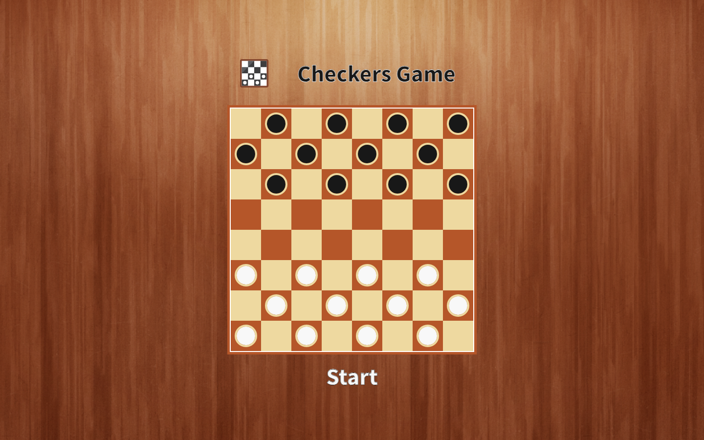
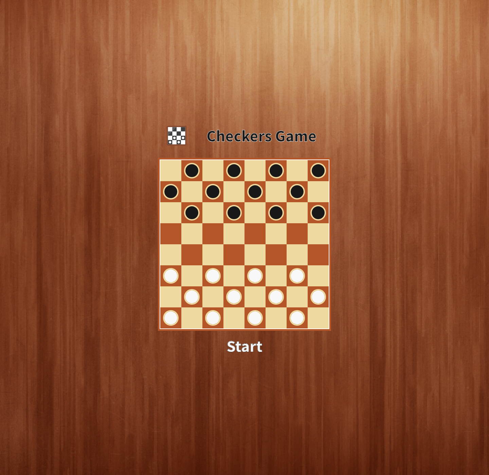
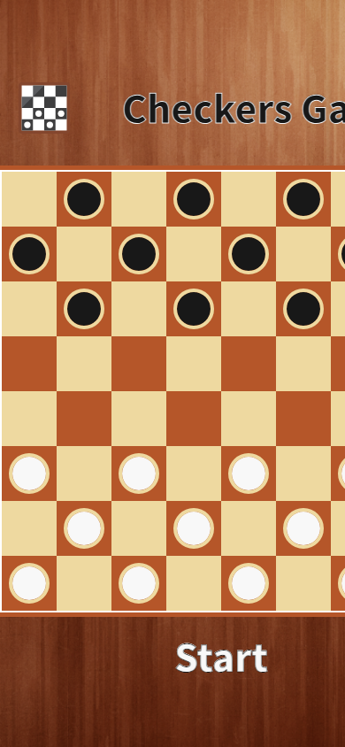

# Checkers Game

A React implementation of the checkers board game with an interactive board and a focused visual game experience. This is an in-progress project; win detection has not yet been implemented.

**Live site:** [onchetrit.github.io/checkersGame](https://onchetrit.github.io/checkersGame/)

## Tech

React, SCSS, and Create React App.

## Screenshots

| Desktop | Game board | Mobile |
| --- | --- | --- |
|  |  |  |

## Run locally

~~~bash
npm install
npm start
~~~

Then open http://localhost:3000.

## Available scripts

~~~bash
npm start
npm test
npm run build
~~~
